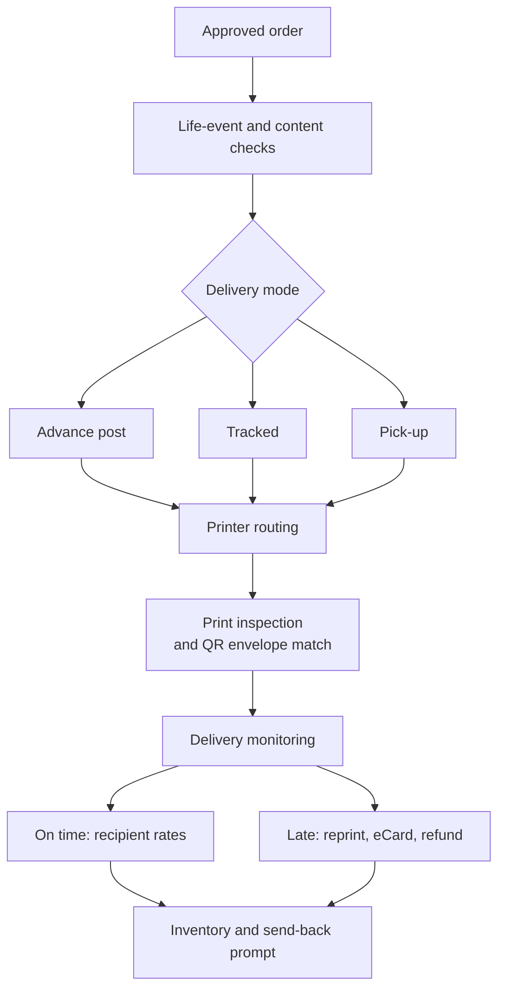

# Dearly: commercial business plan

20 September 2026

## Summary and thesis

Dearly is an AI-run greeting card service that gets a better card to the recipient early, backed by a delivery guarantee, and is operated by two or three people.

The thesis is that large consumer businesses carry cost that AI can now remove. Moonpig is the first target. It serves 12.3m customers and 36.0m orders a year ([FY26 results](https://www.investegate.co.uk/announcement/rns/moonpig-group--moon/final-results/9635380)), spends £38.7m a year on marketing ([Marketing Week](https://www.marketingweek.com/moonpig-doubles-down-marketing-revenue/)), owns its factories, and had 242 data scientists, analysts and engineers in FY24 ([FY24 annual report](https://www.moonpig.group/media/guimundu/moonpig-ara24-full-strategic-report.pdf)).

Dearly replaces each of those with software and partners:

| Moonpig runs                                                                      | Dearly runs                                                                                      |
| --------------------------------------------------------------------------------- | ------------------------------------------------------------------------------------------------ |
| Reminder emails and app notifications that send the customer off to choose a card | Reminders by email, push and text that arrive as a finished card proposal, approved with one tap |
| Its own factories, sized for peak demand                                          | Qualified partner printers, routed by software                                                   |
| Next-day post as the default                                                      | Post sent in advance, tracked only when needed                                                   |
| Human support from 9am to 5:30pm, no phone line                                   | An AI agent at all hours with a fixed list of actions                                            |
| £38.7m a year of marketing                                                        | Business accounts, recipients, florists and pick-up partners                                     |

All Dearly figures in this plan are estimates or proposed starting points. Moonpig figures come from its published reports and help pages.

## How customers are reminded

The whole model depends on the proposal reaching the customer: no reminder, no early approval, no advance post, no margin. Reminder delivery is therefore a core system, not a marketing add-on.

Moonpig takes about 40% of its orders within a week of a reminder. Dearly's claim is that a finished proposal converts better than a bare reminder, and that claim can only be tested if the message arrives and is opened.

### Channels

| Channel                                  | Role                                                                                                                        | Status                                             |
| ---------------------------------------- | --------------------------------------------------------------------------------------------------------------------------- | -------------------------------------------------- |
| Email                                    | The main channel. Shows the proposed card, the date, the arrival promise, the full price and one button: Review and approve | From the first day                                 |
| Push notification                        | Same message on the phone                                                                                                   | When there is an installable web app or native app |
| SMS or WhatsApp                          | The last nudge and urgent cases only                                                                                        | Opt-in; a few pence a message                      |
| Calendar feed                            | The customer's dates appear in their own calendar with a link back                                                          | Later                                              |
| Monthly digest to the HR or office admin | Business accounts: cards scheduled next month, approve or edit                                                              | From the first business pilot                      |

### Cadence

| Days before the occasion | Message                                          |
| ------------------------ | ------------------------------------------------ |
| 21                       | The proposal                                     |
| 14                       | A reminder that includes the advance-post saving |
| 7                        | Last day for advance post                        |
| 3                        | Tracked is still possible                        |
| 1 or 0                   | Pick-up or eCard today                           |

Messages stop as soon as the customer approves or skips. Autopilot customers get one notice saying what will be sent and when, with a way to change it.

### Rules

- The button in a message never approves an order by itself, because security scanners open links automatically. It opens a confirm screen with one Approve and pay button. Links are signed, single-purpose and expiring.
- Paused people never trigger a message. Nothing sensitive goes in a subject line.
- Reminders the customer asked for are service messages. Offers are marketing and need separate consent. This needs legal review.
- Every message shows the same full price the app shows, taken from the same pricing function.
- Customers choose channels and quiet hours, and can stop marketing while keeping reminders.
- The sending domain is authenticated and warmed up before launch, and inbox placement is monitored.

### Cost and measures

A full sequence costs roughly 1p to 5p an order (estimate, unverified), inside the service cost already in the unit economics. The measures are delivery rate, open rate, and reminder-to-order rate at each step of the cadence.

## Market and the opening

Moonpig holds about 70% of UK online single cards, but only 6% of UK card volume is bought online ([Moonpig FY25 at a glance](https://www.moonpig.group/media/exrfm4jc/at-a-glance-fy25-moonpig-group-plc.pdf)). The opening is the occasions Moonpig's own customers do not use it for.

A Moonpig customer orders about three times a year, and a typical UK buyer sends about 19 cards. Moonpig holds 113m saved reminder dates and takes 36.0m orders. About 40% of orders follow a reminder, so roughly 13% of reminders convert (estimate).

| Gap at Moonpig               | Evidence                                                                                                                   | Dearly's answer                                                                                                  |
| ---------------------------- | -------------------------------------------------------------------------------------------------------------------------- | ---------------------------------------------------------------------------------------------------------------- |
| Reminders rarely convert     | About 13% (estimate)                                                                                                       | Dearly also reminds by email, push and text, but each reminder carries a finished proposal to approve in one tap |
| No reward for ordering early | Early orders still pay £1.90 first class ([delivery page](https://www.moonpig.com/uk/delivery-information/))               | Advance post at £0.95                                                                                            |
| Weak late-delivery remedy    | One customer was offered only the delivery charge back                                                                     | Automatic refund, reprint and eCard                                                                              |
| No same-day physical card    | Its same-day answer is an eCard                                                                                            | Pick-up from a partner shop                                                                                      |
| Limited support              | Humans 9am to 5:30pm, no phone line ([contact page](https://help.moonpig.com/en/articles/318764-contact-customer-service)) | AI agent at all hours                                                                                            |
| Card stock                   | 250 to 300gsm ([sizes page](https://help.moonpig.com/en/articles/318238-what-size-are-your-cards))                         | 300, 350 and 400gsm finishes                                                                                     |
| Business sending is new      | Platform launched late 2025 ([Moonpig for Business](https://www.moonpig.com/uk/business/))                                 | HR sync, office drops, invoicing                                                                                 |
| Recipients are not recruited | No recipient account or archive found                                                                                      | QR code, Inventory, send-back prompts                                                                            |

Dearly does not attack Moonpig's strengths: its reminder database, its brand, its print scale, its 9pm next-day cut-off, or generic Google search terms.

## Customers and segments

Dearly serves three groups, and each one feeds the next.

| Segment           | Who                                                       | Why they buy                                    | Role in the model                             |
| ----------------- | --------------------------------------------------------- | ----------------------------------------------- | --------------------------------------------- |
| Business accounts | HR teams, office managers, client-facing teams            | Saves staff time, never misses a date, on-brand | Revenue without advertising; seeds recipients |
| Recipients        | Employees, clients, friends and family who receive a card | They scan the QR code to keep or rate the card  | Free customer acquisition                     |
| Consumers         | People who send cards to close family and friends         | Better card, arrives early, one tap             | Core repeat revenue                           |

Community occasions widen the consumer base. The 2021 census counted 3.9m Muslims, 1.0m Hindus, 524,000 Sikhs and 271,000 Jews in England and Wales ([census summary](https://lawandreligionuk.com/2022/11/29/2021-census-for-england-wales-religious-affiliation/)). Dearly serves Eid, Diwali, Vaisakhi, Hanukkah and Women's Day with ranges made by designers from those communities.

## Product

The product is a relationship assistant: it knows the customer's people and dates, and proposes the right card about three weeks ahead.

### Consumer

- **Reminder list.** Customers import people and dates by pasting notes or syncing contacts. The AI sorts them into relationships and occasions.
- **Proposals.** Each proposal has a design, a message in the sender's voice, a size, a finish, an optional gift and a delivery mode. The customer approves, edits or skips. Payment is taken on approval. Each proposal reaches the customer by email, with push and text as opt-in extras, and links to a confirm screen.
- **Life-event guard.** Proposals pause after a bereavement, a break-up or an unconfirmed address. This is the most important safety feature.
- **Card editor.** Photo quality check, handwriting by photo, a handwritten signature, a child's drawing as the card front, and AI-personalised card fronts labelled as AI-made.
- **Rich eCards.** Text and fonts, a drawing canvas, animated templates, voice and video messages, and export as a short video that plays inside messaging apps.
- **Narration.** The sender reads the message aloud. The recipient hears it while the words appear in time with the voice. It plays in eCards, in the exported video, and from the QR code in a printed card. Launch with the sender's own recording; a stock synthetic voice is the fallback. Never clone another person's voice.
- **QR code on every printed card.** It opens a page where the recipient rates the card, saves it and is prompted to send one back.
- **Inventory.** Account holders see three years of sent and received cards and can download them.
- **Guarantee.** A full refund and a discount on the next card if an advance or tracked order misses its date, paid automatically from tracking data.
- **Help.** An AI voice and chat agent that can refund, reprint, upgrade delivery or send an eCard, and hands distressed callers to a person.

### Business

- Staff list upload or HR-system sync, cleaned by the AI.
- Automatic scheduling of birthdays, work anniversaries and client dates.
- Office batch drop or post to home.
- Giant group cards with signatures collected online.
- Brand kit, on-brand AI card sets, approvals, invoicing and reporting.
  Moonpig already offers handwriting upload and an AI handwriting font ([handwriting page](https://www.moonpig.com/uk/handwriting/)), and links video messages to printed cards. Dearly's edge is in signatures, children's drawings, group signing, narration and the recipient archive.

## Range and pricing

Every design is sold in three sizes and three finishes, with Regular and Signature preselected so most buyers land on the middle option.

### Card prices (including VAT)

| Size       | Classic, 300gsm | Signature, 350gsm (default) | Luxe, 400gsm textured |
| ---------- | --------------- | --------------------------- | --------------------- |
| Regular    | £2.99           | £3.99                       | £6.49                 |
| Large (A4) | £4.99           | £6.49                       | £8.99                 |
| Giant (A3) | £9.99           | £11.99                      | £14.99                |

Every card ships in a board-backed mailer. Customers choose size first and finish second, and see the full price including delivery before paying. Moonpig charges £3.99 for a standard card; its Large and Giant prices still need checking.

### Delivery (proposed)

| Mode                                   | Regular | Large       | Giant       | Guarantee |
| -------------------------------------- | ------- | ----------- | ----------- | --------- |
| Advance post, second class, sent early | £0.95   | £1.95       | Not offered | Yes       |
| Tracked, next day                      | £2.75   | £3.75       | £3.99       | Yes       |
| Pick-up, ready in two hours            | Free    | Not offered | Not offered | No        |

A Regular Signature card by advance post costs £4.94. Moonpig's standard card with first-class post costs £5.89.

### Digital

- Standalone eCard: £0.79, sold singly or in credit packs.
- Digital copy bought with a printed card: £0.29.
- Both include fonts, drawing, animation, narration, voice and video.
- Recommendation: every printed card's QR code still opens a free rating and sign-up page. The £0.29 upgrades it to the full saved copy. Otherwise only paying senders' recipients can join.

### Business (before VAT, Signature Regular)

| Option                                                  | Price                 |
| ------------------------------------------------------- | --------------------- |
| Posted to home, second class in advance                 | £3.30 a card          |
| Office batch drop                                       | £2.30 a card          |
| From 250 cards a year                                   | £3.10 a card          |
| From 2,000 cards a year                                 | £2.80 a card          |
| Automate plan: HR sync, approvals, brand kit, reporting | £49 a month, optional |
| Trial                                                   | First 25 cards free   |

Moonpig lists £3.60 a card including postage for business customers ([Moonpig for Business](https://www.moonpig.com/uk/business/)).

### Offers

- First card free on sign-up: the customer pays postage and adds three to five reminder dates.
- Seasonal and community offers go to new customers only. No blanket peak discounts.

## Go-to-market

Dearly wins customers through channels that do not depend on paid clicks, because a first order won through Google costs £6 to £23 (estimate) and earns about £2.

1. **Business accounts first.** They bring revenue with no advertising spend. Every card lands with an employee or client who can become a consumer customer. Sell on reliability, integration and saved staff time, and only slightly under Moonpig on price.
2. **Recipient loop.** Each printed card carries a QR code. The recipient rates the card, saves it to an Inventory and is prompted to send one back. Each account costs nothing to acquire and adds a birthday and a relationship.
3. **Florists send customers to Dearly.** After a flower checkout, the florist shows an offer: Dearly remembers the date, first card free. The next year Dearly proposes flowers from the same florist, so value flows both ways. UK flower search volume is down 7.3% since 2022 ([Salience report](https://salience.co.uk/report/florist-retailers-market-performance-report)), so florists need repeat customers. Target mid-sized online florists and networks of independent shops.
4. **Pick-up partners.** Local print shops and florists act as same-day collection points. Pilot in one city.
5. **Conditional free first card.** It raises conversion on every other channel and fills the reminder list.
6. **Paid search.** Kept small, and grown only when payback within 12 months is proven.
   Target acquisition cost is under £5 a customer (estimate). Florist referral fees of £1 to £2 can be offset by commission of 6% to 8% on repeat flower orders Dearly sends back.

## Operations and quality

Dearly owns no factory. Orders go to qualified partner printers, and most cards are printed and posted days ahead, so the business needs no next-day production line.

The AI chooses the delivery mode from the days left, the card size and the postcode's delivery record.

### Delivery

- Target: 70% of orders by advance post. Second class costs 91p against £1.80 for first class ([Royal Mail rates](https://www.mailcoms.co.uk/current-royal-mail-postage-rates/)).
- Royal Mail's targets are 90% of first class next day and 95% of second class within three days. A five-to-ten-day buffer removes almost all lateness.
- Tracked post covers urgent orders and all Giant cards. Pick-up covers same-day needs.
- Consolidation: two cards to one address share an envelope; business cards go in office batch drops.

### Quality system

1. One written specification for every printer: board, varnish, creasing, envelope, board-backed mailer.
2. Each printer is qualified with a standard test sheet before taking orders. One specialist prints Luxe and Giant.
3. Customer photos are checked for resolution and cropping before printing.
4. Every card is photographed at packing. The AI compares it with the intended image, and the QR code confirms the card matches its envelope.
5. Recipients rate the card from the QR page. Scores feed a scorecard per printer, and routing favours the better ones.
6. Free reprint on any quality complaint. Target under 1% reprints.
7. Pick-up shops must use Dearly's stock on a qualified printer.

### Planning

The reminder list is the demand forecast. Dearly shares a 13-week rolling forecast with printers and carriers, prints peak-season cards ahead at a steady rate, and pays customers a small discount to confirm early when that saves more in postage.

## Designs and content supply

Dearly launches with about 150 commissioned designs and an open creator marketplace, with customer content and AI personalisation layered on top.

| Source                       | Use                                                                         | Cost model                                                                                                                                     |
| ---------------------------- | --------------------------------------------------------------------------- | ---------------------------------------------------------------------------------------------------------------------------------------------- |
| Commissioned core collection | Defines Dearly's look; community ranges by designers from those communities | Flat fee or advance; roughly £15,000 to £40,000 in total (estimate)                                                                            |
| Creator marketplace          | Breadth without a design team                                               | Per-card royalty; creators keep copyright                                                                                                      |
| Licensed publisher ranges    | Proven sellers, added later                                                 | Licence fee plus 3% to 8% of trade price ([Writers & Artists](https://www.writersandartists.co.uk/advice/illustrating-greeting-card-industry)) |
| Customer content             | Photos, handwriting, children's drawings                                    | Free                                                                                                                                           |
| AI personalisation           | One-off fronts, on-brand business sets                                      | A few pence per image (unverified)                                                                                                             |
| Public-domain art            | A classic-art range                                                         | Free; check each licence                                                                                                                       |

Thortful built its range from independent creators and says it has paid them more than £12m in royalties ([Retail Times](https://retailtimes.co.uk/thortful-creates-12-million-in-royalties-for-its-community-of-creators/)).

Rules: AI-made designs are labelled. An artist's style is copied only with consent and a revenue share. Contracts must cover all sizes and finishes, animation, the digital copy, the Inventory and personal downloads. AI screens uploads for copied characters, logos and offensive content, and a person approves.

## Team and operating model

Three people run Dearly, and each owns decisions the AI is not allowed to make.

| Role                     | Owns                                                      | The AI does                                                                                            |
| ------------------------ | --------------------------------------------------------- | ------------------------------------------------------------------------------------------------------ |
| Product and AI engineer  | The app, the models, the data, security                   | Proposals, moderation, routing, forecasting, list clean-up                                             |
| Operations and partners  | Printers, carriers, quality, florist and pick-up partners | Print inspection, delivery monitoring, scorecards, recovery                                            |
| Growth and customer care | Business sales, partnerships, escalations, brand          | Reminder and recovery messages, voice and chat agent, ad creative, outreach drafts, royalty statements |

### Guardrails

- A person approves anything that spends a customer's money or contacts someone for the first time.
- The AI acts only from a fixed list of actions. It cannot invent promises.
- Every automated decision is logged and can be reviewed.
- Customers can switch any automation off.
- Bereavement, distress and legal complaints always go to a person.
  The measure of the thesis is orders per team member. Moonpig's overhead excluding marketing is about £1.57 an order (estimate). Dearly matches that at about 210,000 orders a year and falls below it as volume grows.

## Unit economics

A Regular card-only order contributes about £1.35 to £3.40 before marketing, and about £2.15 on the expected mix of finishes. All figures are estimates.

| Per Regular card by advance post    | Classic     | Signature   | Luxe        |
| ----------------------------------- | ----------- | ----------- | ----------- |
| Customer pays, card plus £0.95 post | £3.94       | £4.94       | £7.44       |
| Revenue after VAT                   | £3.28       | £4.12       | £6.20       |
| Print, envelope and mailer          | £0.67       | £0.80       | £1.45       |
| Second-class postage                | £0.88       | £0.88       | £0.88       |
| Payment fee at list rates           | £0.26       | £0.27       | £0.31       |
| Guarantee, AI and service           | £0.18       | £0.18       | £0.18       |
| Contribution                        | about £1.30 | about £2.00 | about £3.40 |

Payment fees assume Stripe's UK list rate of 1.5% plus 20p ([Wise summary](https://wise.com/gb/blog/Stripe-payments-charges-uk)).

- **Mix.** If 20% choose Classic, 60% Signature and 20% Luxe, blended contribution is about £2.15.
- **Larger cards.** A Large Signature card contributes roughly £3 and a Giant roughly £5. Both depend on print quotes and a postage tariff not yet checked.
- **Gifts.** An attached gift roughly triples the contribution of an order.
- **Business cards.** About £1.50 to £1.80 posted and £1.25 to £1.55 by office drop.
- **Digital.** A standalone eCard leaves roughly 55p to 60p when sold through credit packs. The £0.29 paired copy is almost all margin.
- **AI running cost.** About 3p to 8p an order, including the voice agent.
- **Reminder messages.** Roughly 1p to 5p an order for the full email sequence plus an occasional text (estimate, unverified). This sits inside the 8p service cost.
- **Moonpig comparison.** Moonpig keeps about £3.70 on a card-only order (estimate). Dearly is worse on print cost and better on postage and fixed cost.

## Financial scenarios and funding

On these assumptions Dearly loses about £230,000 in year one, breaks even in year two and needs roughly £400,000 to £600,000 of funding. These are illustrative scenarios, not forecasts.

|                             | Year 1                 | Year 2                   | Year 3                |
| --------------------------- | ---------------------- | ------------------------ | --------------------- |
| Consumer customers          | 15,000                 | 60,000                   | 150,000               |
| Business accounts           | 40                     | 200                      | 500                   |
| Orders                      | about 70,000           | about 330,000            | about 900,000         |
| Contribution                | about £160,000         | about £770,000           | about £2.1m           |
| Team, tools and acquisition | about £390,000         | about £600,000           | about £900,000        |
| Result                      | loss of about £230,000 | profit of about £170,000 | profit of about £1.2m |

- **Fixed costs.** Three people plus tools cost roughly £330,000 a year. Year two adds a fourth person.
- **Break-even.** About 150,000 orders a year before acquisition spend.
- **Acquisition.** £4 per new consumer customer, which depends on the unpaid channels working.
- **Business accounts.** Each is assumed to send about 600 cards a year. Winning 200 accounts by year two with a small team is the most optimistic line.
- **Most sensitive assumptions.** Acquisition cost, orders per customer, the share of orders approved in advance, and the pace of business sales.
  If customers still order at the last minute, Dearly runs at next-day economics without Moonpig's scale, and the model fails. The share of orders approved in advance is the first number to prove.

## Risks and compliance

The largest commercial risk is that Moonpig or Card Factory copies the features; the largest operating risk is a card sent automatically after a death. None of the legal points below is legal advice, and each needs a lawyer.

| Risk                                | What could happen                                                                                     | Response                                                                                                                   |
| ----------------------------------- | ----------------------------------------------------------------------------------------------------- | -------------------------------------------------------------------------------------------------------------------------- |
| Incumbent response                  | Moonpig promotes its Economy post or matches prices; Card Factory adds personalised click and collect | Treat price as a tactic; build the reminder list, Inventory and business integrations, which are harder to copy            |
| Last-minute ordering persists       | Advance share stays low and postage savings vanish                                                    | Early-approval discount, autopilot for chosen relationships, track advance share weekly                                    |
| Life events                         | A card goes to someone who has died                                                                   | Life-event guard, yearly address confirmation, opt-in autopilot limited to chosen people                                   |
| Quality variance                    | Partner printers differ                                                                               | One specification, qualification, inspection, scorecards, free reprints                                                    |
| Royal Mail dependence               | Slower or dearer letters                                                                              | Advance buffer, tracked and pick-up alternatives, carrier mix for parcels                                                  |
| Free-card abuse                     | Freebie hunters and duplicate accounts                                                                | Customer pays postage, verified phone or payment card, reminder dates required                                             |
| Partner concentration               | A few florists supply most referrals                                                                  | Many small partners, equal commission terms both ways                                                                      |
| Reminders do not reach the customer | Emails land in spam or go unopened, so proposals are never seen and orders stay last-minute           | Authenticated sending domain, inbox monitoring, push and opt-in text as back-ups, delivery and open rates tracked per step |

### Compliance list

- **Automated orders.** Clear consent in advance. New UK subscription rules bring reminder notices, easy cancellation and cooling-off periods; most sources expect them around spring 2027 ([Ashurst note](https://www.ashurstperkinscoie.com/en/insights/click-subscribe-comply-preparing-for-the-uks-new-subscription-contract-regime/)), and the date should be checked.
- **Personal data.** Recipients and imported contacts are third parties. Market to a recipient only after they opt in. Handwriting, signatures and voice recordings need secure storage and deletion on request.
- **User content.** Video, audio and drawings bring duties on harmful and illegal content. Screen uploads, offer a report button, and get advice on how UK online safety law applies to private card links.
- **Voice.** Never clone another person's voice. Clone the sender's own only with explicit consent.
- **Designs.** Licence terms for every source, labels on AI-made designs, blocks on brand and character prompts, licensed music only.
- **App stores.** Moonpig says it cannot offer eCards in its apps ([eCard FAQ](https://help.moonpig.com/en/articles/318717-ecard-faqs)). Sell digital cards and credits on the web.
- **Pricing display.** Show the full price, including delivery, before checkout.
- **AI disclosure.** Callers are told the voice agent is an AI.
- **Reminder messages.** Reminders the customer asked for are service messages; offers are marketing and need separate consent and an unsubscribe. Text messages need their own opt-in. Message links never approve an order without a confirm screen.

## Milestones and measures

The first year runs in three stages: prove the pilot with business accounts, launch to consumers, then add gifts and the Automate plan.

| Period         | Milestones                                                                                                                                                |
| -------------- | --------------------------------------------------------------------------------------------------------------------------------------------------------- |
| Months 0 to 3  | Pilot app built, with reminder emails live; two printers qualified; five business pilot accounts; two florist pilots; core design collection commissioned |
| Months 3 to 6  | Consumer launch with the free first card; autopilot; pick-up pilot in one city; community ranges; creator marketplace open                                |
| Months 6 to 12 | Gifts and flowers through partners; Automate plan; rich eCards with narration and video; second wave of printers and florists                             |
| Year 2         | Quarterly parcels, wholesale to shops, a second country                                                                                                   |

### Measures

| Measure                                               | Why it matters                               | Target                                      |
| ----------------------------------------------------- | -------------------------------------------- | ------------------------------------------- |
| Share of orders approved in advance                   | Drives postage cost and the whole model      | 70%                                         |
| Proposal-to-order rate                                | The core claim against Moonpig's roughly 13% | Above 30%                                   |
| Orders per customer a year                            | Lifetime value                               | 4 or more                                   |
| Reminder dates per customer                           | The asset                                    | 8 or more                                   |
| On-time rate, advance and tracked                     | Guarantee cost                               | 98% or more                                 |
| Reprint rate                                          | Quality                                      | Under 1%                                    |
| Recipient sign-up rate                                | Free acquisition                             | 10% of cards                                |
| Finish mix                                            | Margin                                       | 20 / 60 / 20                                |
| Acquisition cost and payback                          | Discipline on spend                          | Under £5, within 12 months                  |
| Orders per team member                                | The thesis                                   | Rising every quarter                        |
| Reminder delivery and open rate                       | A proposal that is not seen cannot convert   | 98% delivered, 50% opened                   |
| Reminder-to-order rate by step (21, 14, 7, 3, 1 days) | Shows which message drives early approval    | Most orders from the 21 and 14 day messages |

Targets are starting points to test, not commitments.

## What to validate before spending

These checks decide whether the numbers in this plan hold, and none of them needs the product to exist.

- [ ] Quotes from three trade printers and one specialist for Luxe and Giant, against the written specification
- [ ] Quotes for board-backed mailers, lined envelopes and varnish or laminate
- [ ] Royal Mail business account terms and the 2026 large-letter tariff
- [ ] Moonpig's current Large and Giant card prices, and the price of its Economy post
- [ ] Google keyword prices for the terms Dearly would bid on
- [ ] Interviews with five to ten business buyers on price, HR integration and office drops
- [ ] Conversations with five florists about the referral scheme and commission both ways
- [ ] A test of digital pricing: £0.29 paired and £0.79 standalone against a free basic copy
- [ ] A test of finish names, the Signature default and its price at £3.49, £3.99 and £4.49
- [ ] What creators earn per card elsewhere, from a few Thortful sellers
- [ ] The depth of Moonpig's Eid, Diwali, Vaisakhi and Hanukkah ranges
- [ ] Legal advice on automated orders, recipient data, user content, voice and design licences
- [ ] Email set-up: an authenticated sending domain, an inbox-placement test with the main mail providers, and legal advice on service against marketing messages
- [ ] A trademark check on Dearly, Classic, Signature and Luxe

## Sources

- [Moonpig FY26 results](https://www.investegate.co.uk/announcement/rns/moonpig-group--moon/final-results/9635380)
- [Moonpig FY25 at a glance](https://www.moonpig.group/media/exrfm4jc/at-a-glance-fy25-moonpig-group-plc.pdf)
- [Moonpig FY24 annual report, strategic report](https://www.moonpig.group/media/guimundu/moonpig-ara24-full-strategic-report.pdf)
- [Marketing Week on Moonpig's FY26 marketing spend](https://www.marketingweek.com/moonpig-doubles-down-marketing-revenue/)
- [Moonpig delivery information](https://www.moonpig.com/uk/delivery-information/)
- [Moonpig card sizes and stock](https://help.moonpig.com/en/articles/318238-what-size-are-your-cards)
- [Moonpig contact page](https://help.moonpig.com/en/articles/318764-contact-customer-service)
- [Moonpig eCard FAQ](https://help.moonpig.com/en/articles/318717-ecard-faqs)
- [Moonpig for Business](https://www.moonpig.com/uk/business/)
- [Royal Mail rates, Mailcoms](https://www.mailcoms.co.uk/current-royal-mail-postage-rates/)
- [Salience florist industry report](https://salience.co.uk/report/florist-retailers-market-performance-report)
- [Thortful royalties, Retail Times](https://retailtimes.co.uk/thortful-creates-12-million-in-royalties-for-its-community-of-creators/)
- [Card royalty norms, Writers & Artists](https://www.writersandartists.co.uk/advice/illustrating-greeting-card-industry)
- [2021 census religion figures](https://lawandreligionuk.com/2022/11/29/2021-census-for-england-wales-religious-affiliation/)
