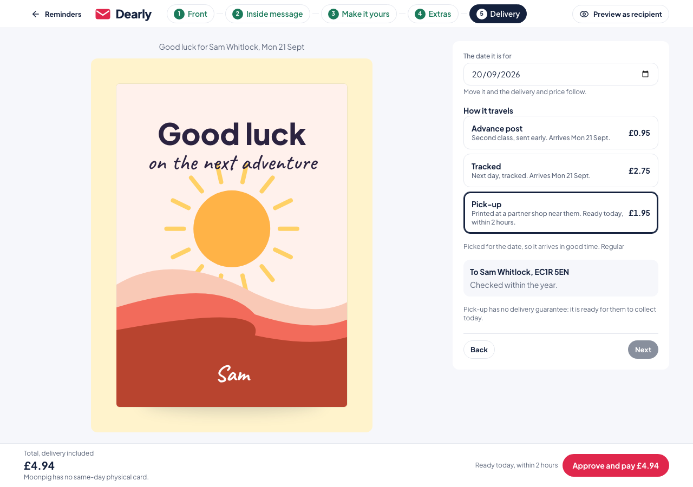
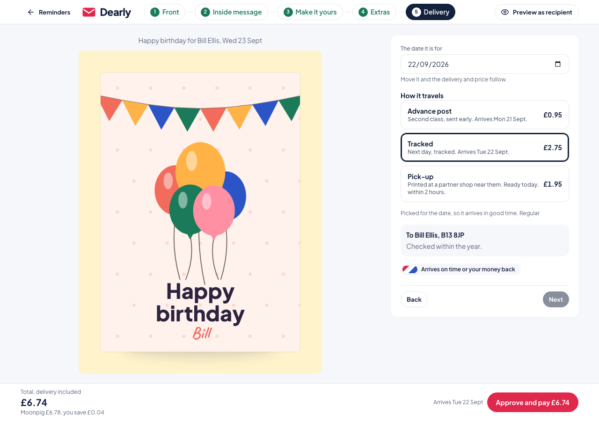
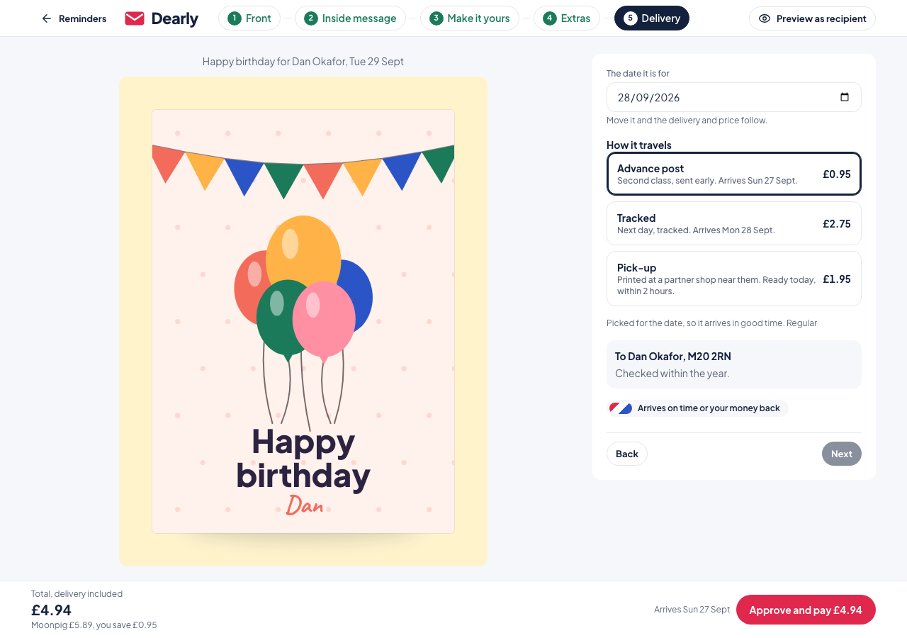
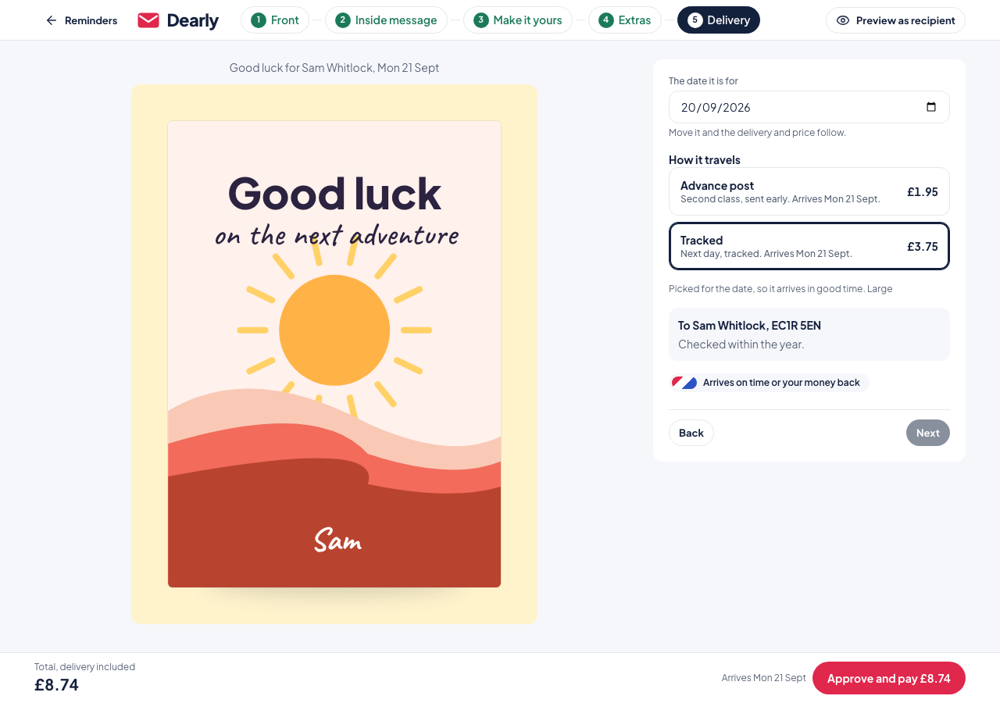
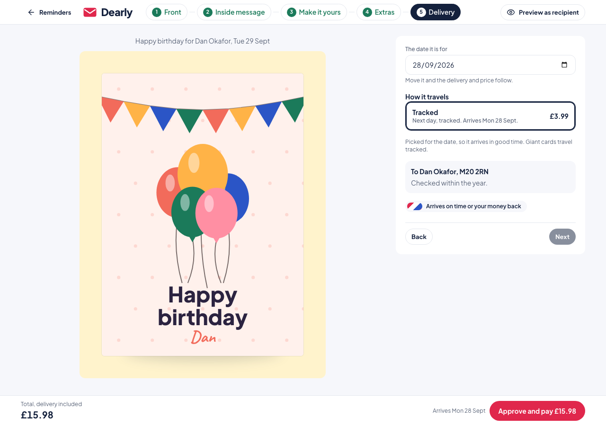
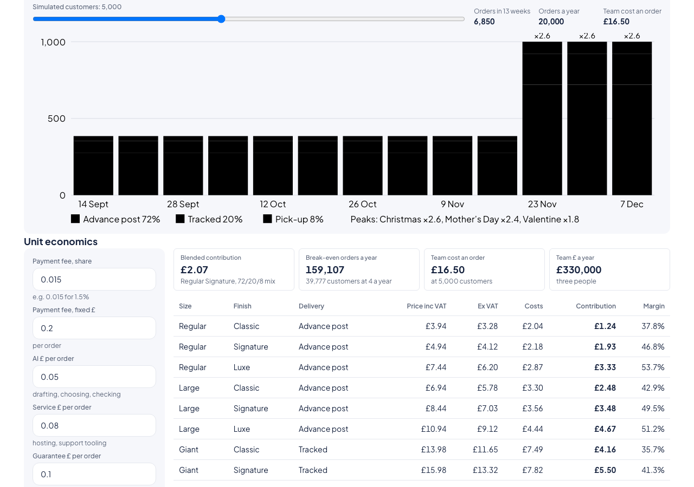

# Pricing audit

Reconciliation of every price, cost, fee and economic figure against the canonical specification, now generated into [`docs/pricing.md`](pricing.md) by `pnpm docs:pricing`. The rule applied throughout: `src/domain/constants.ts` is the only place a price or cost may be written; everything else derives from it through `quote()` and the economics functions. Where code, tests or docs disagreed with the specification, the specification won.

## 1. Literal scan

Search: `grep -rnE "£\s?[0-9]|[0-9]+\.[0-9]{2}" src prisma e2e docs README.md` with CSS, animation, opacity, version and date values filtered out. Every hit outside `src/domain/constants.ts` and its tests is listed with a verdict. `src/domain/__tests__/no-price-literals.spec.ts` now fails the unit run when a currency amount or two-decimal literal appears in `src/app`, `src/components` or `src/server` outside the allow-list below.

| Location                                                                    | Hit                                                                                              | Verdict            | Resolution                                                                                                                  |
| --------------------------------------------------------------------------- | ------------------------------------------------------------------------------------------------ | ------------------ | --------------------------------------------------------------------------------------------------------------------------- |
| `src/components/store/Footer.tsx`                                           | "from £2.30 a card"                                                                              | derive             | `formatPence(toPence(BUSINESS.officeDrop))`, now also says "excluding VAT"                                                  |
| `src/components/store/BrowseView.tsx`                                       | "From £2.99 plus delivery"                                                                       | derive             | `fromPricePence()` from `src/lib/pricing.ts` (a Regular Classic card through `quote()`)                                     |
| `src/components/editor/steps/DeliveryStep.tsx`                              | `price ? formatPence(...) : 'Free'`                                                              | delete             | pick-up is £1.95, so the "Free" branch is gone; the price always comes from `MODES`                                         |
| `src/server/services/ecards.ts`                                             | "for 79p", "Payment of £0.79 captured"                                                           | derive             | both interpolate `formatPence(q.totalPence)` from the eCard quote                                                           |
| `src/server/services/partners.ts`                                           | "£1.50 owed", `(pence / 100).toFixed(2)`                                                         | derive             | `formatPence(ledger.referralFeePence)` and `formatPence(ledger.expectedCommissionPence)`                                    |
| `src/server/services/operations.ts`                                         | postage saved = Regular advance orders × (Moonpig first class 1.90 − Dearly advance 0.95)        | move               | spec formula: advance orders × (first class 1.80 − second class 0.91) from new `STAMPS`, labelled an estimate on Operations |
| `src/domain/florist.ts`                                                     | `FLORIST_REFERRAL_FEE_PENCE = 150`, `FLORIST_COMMISSION_PCT = 7`, "Bouquet: Autumn Glow, £35.00" | move               | `FLORIST = { referralFee: 1.5, commissionPct: 7, sampleBasket: 35 }` in constants; the florist module derives from it       |
| `src/domain/business.ts`                                                    | comment "Moonpig at £3.60 a card"                                                                | derive             | comment now refers to `BUSINESS.moonpigPerCard`                                                                             |
| `src/domain/recovery.ts`                                                    | "50% off the next card"                                                                          | derive (wording)   | "50% off the card price of the next order", single-use, delivery not included                                               |
| `src/app/(hq)/hq/operations/page.tsx`                                       | "£38.7m a year (FY26)" and the other Moonpig figures in the thesis table                         | keep, allow-listed | Moonpig's published figures, not Dearly prices; the file is on the scan allow-list with the reason                          |
| `src/server/ai/claudeProvider.ts`                                           | token prices and "£0.78 to $1"                                                                   | keep, allow-listed | an exchange-rate assumption for the decision-log cost estimate, not a customer price                                        |
| `src/server/adapters/printers.ts`                                           | inspection score 4.82                                                                            | keep, allow-listed | a simulated quality score, not money                                                                                        |
| `src/components/operations/EconomicsPanel.tsx`                              | labels "Payment £ fixed", "AI £ per order"                                                       | keep               | labels with no amount; the inputs are bound to the editable costs                                                           |
| `e2e/core-flow.spec.ts`, `e2e/browse-to-order.spec.ts`, `e2e/ecard.spec.ts` | '£4.94', '£5.89', '£8.44', '£10.94', '£6.74', '£0.79'                                            | derive             | `e2e/prices.ts` computes every asserted string from `quote()` and `MODES`                                                   |
| `docs/handoff.md`                                                           | "contributions 1.24/1.94/3.33"                                                                   | fix                | 1.93 for Signature; points at this audit                                                                                    |
| `docs/design/restructure.md`                                                | "eCard only £0.79"                                                                               | keep               | matches `DIGITAL.standalone`; the generated `docs/pricing.md` is the reference                                              |
| `README.md`                                                                 | "1.75 stroke"                                                                                    | keep               | an icon stroke width, not money                                                                                             |

## 2. Disagreements with the specification

Each row is a place where code, tests or docs said something different from the specification. All were fixed in favour of the specification.

| #   | Area                           | Before                                                                           | Specification                                                                                                                          | Fix                                                                                                                                                                                                                                                                                               |
| --- | ------------------------------ | -------------------------------------------------------------------------------- | -------------------------------------------------------------------------------------------------------------------------------------- | ------------------------------------------------------------------------------------------------------------------------------------------------------------------------------------------------------------------------------------------------------------------------------------------------- |
| 1   | Pick-up price                  | £0.00 ("Free")                                                                   | £1.95 for Regular only                                                                                                                 | `MODES.pickup.price.regular = 1.95`; every "free" pick-up string removed                                                                                                                                                                                                                          |
| 2   | Pick-up cost                   | delivery cost 0.60 on top of the print cost                                      | partner payout 1.75 + stock 0.25 = 2.00, replacing the print cost, no guarantee reserve                                                | new `PICKUP` constant; `quote()` uses it as the print cost and sets the delivery cost to 0                                                                                                                                                                                                        |
| 3   | Pick-up eligibility            | any Regular card, any finish                                                     | Regular Classic or Signature only; Luxe falls back to tracked                                                                          | `allowedModes(size, finish)`, `chooseMode(size, daysLeft, finish)`, `pickupAllowed()`; services and the editor pass the finish; changing the finish re-applies the rule when the mode was not overridden                                                                                          |
| 4   | Pick-up wording                | "ready in 2 hours", "Arrives {date}"                                             | "Ready today, within 2 hours", never "arrives"                                                                                         | `PICKUP_PROMISE` constant used by the delivery step, reminder card, order card, basket and sticky bar                                                                                                                                                                                             |
| 5   | Moonpig comparison for pick-up | none                                                                             | "Moonpig has no same-day physical card."                                                                                               | `quote()` sets `moonpigNote` for Regular pick-up                                                                                                                                                                                                                                                  |
| 6   | Negative saving                | comparison shown for Regular Luxe (Moonpig 5.89 against 7.44)                    | hide the line when the saving is negative                                                                                              | product page and personalise bar hide it; the eCard path never shows it                                                                                                                                                                                                                           |
| 7   | Rounding                       | `exVat()` and the payment fee were rounded before the subtraction                | round half up once at the end                                                                                                          | `exVatExact()`, `roundPence()`; `quote()` keeps exact arithmetic until each reported figure                                                                                                                                                                                                       |
| 8   | Blended contribution           | 72/20/8 by delivery mode, Signature only (about 1.91)                            | 20% Classic + 60% Signature + 20% Luxe, Regular, advance = 2.07                                                                        | new `BLEND` constant; `blendedContributionExact()`                                                                                                                                                                                                                                                |
| 9   | Break-even                     | about 173,000 orders from the old blend                                          | team cost / blended = 159,107 orders                                                                                                   | `economics()` divides the exact blend and reports the truncated quotient (33,000,000 / 207.41 = 159,107.7 → 159,107, as the specification states)                                                                                                                                                 |
| 10  | Postage saved                  | Regular advance orders × (1.90 − 0.95)                                           | advance orders × 0.89 (first class 1.80 − second class 0.91), labelled estimate                                                        | `STAMPS` constant; Operations label says "estimate"                                                                                                                                                                                                                                               |
| 11  | First card free                | not implemented                                                                  | once per account, Regular Classic or Signature, card price 0, delivery, digital copy and gifts charged, needs 3 or more reminder dates | `FIRST_CARD_FREE` constant, `firstCardFreeApplies()`, `firstCardFreeEligible()`, `quote({ firstCardFree })`; `firstCardFreeFor(accountId)` in the proposal service (no printed order yet and at least three reminder dates). The demo account has two seeded orders, so demo prices are unchanged |
| 12  | Business payment cost          | 1.5% + 0.20 per batch                                                            | 1% of the invoice                                                                                                                      | `BUSINESS.paymentPct = 0.01`; `priceBatch()` and `businessUnitContributionPence()`                                                                                                                                                                                                                |
| 13  | Business guarantee reserve     | none                                                                             | 0.10 per card (posted and office drop)                                                                                                 | included in `businessUnitCostExact()`                                                                                                                                                                                                                                                             |
| 14  | Office drop delivery cost      | 0.30                                                                             | 0.18                                                                                                                                   | `BUSINESS_COSTS.officeDropDelivery = 0.18`                                                                                                                                                                                                                                                        |
| 15  | Business finishes              | Classic, Signature and Luxe offered                                              | Regular Signature (and Classic); Luxe is not in the pilot                                                                              | `BUSINESS.finishes`, `BusinessFinishSchema` on the schedule route, workbench select limited                                                                                                                                                                                                       |
| 16  | Automate free cards            | 25 a month (300 a year) in the annual calculator                                 | first 25 cards free                                                                                                                    | `annualCalculator()` includes 25 once                                                                                                                                                                                                                                                             |
| 17  | Refund code                    | "50% off the next card"                                                          | 50% off the card price (not delivery) of the next order, single use                                                                    | recovery action label and detail                                                                                                                                                                                                                                                                  |
| 18  | Florist constants              | in `src/domain/florist.ts`                                                       | in constants                                                                                                                           | `FLORIST`                                                                                                                                                                                                                                                                                         |
| 19  | Test expectations              | `delivery.test.ts`, `forecast.test.ts`, `business.test.ts` encoded the old rules | specification values                                                                                                                   | updated; `pricing.spec.ts` adds the table-driven expected values and the 3 × 3 × modes snapshot                                                                                                                                                                                                   |
| 20  | Documentation                  | figures scattered in README, hand-off and design docs                            | one generated document                                                                                                                 | `docs/pricing.md`, checked by CI (`pnpm docs:pricing:check`)                                                                                                                                                                                                                                      |

Not in the pilot and confirmed absent from the code: early-approval discount, credit packs, seasonal discounts, tiered office-drop pricing, Luxe for business, any Moonpig Large or Giant price.

## 3. Expected values reproduced

All rows of the specification's expected-values table are asserted in `src/domain/__tests__/pricing.spec.ts` (totals exact, contributions within 1p) and appear in `docs/pricing.md` section 15, generated from `quote()`. The full matrix is snapshotted in `src/domain/__tests__/__snapshots__/pricing.spec.ts.snap`.

## 4. Verification in the running app

Screenshots taken by `pnpm exec tsx scripts/pricing-screenshots.ts` against the production build with seeded data (AI provider: mock).

| Check                                                               | Expected                                                                                                                | Screenshot                                                         |
| ------------------------------------------------------------------- | ----------------------------------------------------------------------------------------------------------------------- | ------------------------------------------------------------------ |
| Sam Whitlock, colleague, leaving tomorrow: Regular Classic, pick-up | total £4.94, pick-up £1.95, "Ready today, within 2 hours", no guarantee badge, "Moonpig has no same-day physical card." |                     |
| Bill Ellis, 3 days: Regular Signature, tracked                      | total £6.74                                                                                                             |                  |
| Dan Okafor, 9 days: Regular Signature, advance                      | total £4.94, "Moonpig £5.89, you save £0.95"                                                                            |                    |
| Sam switched to Luxe                                                | pick-up tile gone, tracked selected, guarantee back                                                                     |    |
| Sam switched to Large Classic                                       | pick-up tile gone                                                                                                       |  |
| Dan switched to Giant                                               | tracked only, £3.99, no advance                                                                                         |     |
| Operations economics                                                | blended £2.07, break-even 159,107                                                                                       |            |

## 5. Commands

```
pnpm check                 # lint, format, typecheck, unit tests including the literal scan and the matrix
pnpm docs:pricing:check    # regenerate docs/pricing.md and fail on any difference
pnpm build && pnpm test:e2e
pnpm start:local           # then, in another terminal:
pnpm exec tsx scripts/pricing-screenshots.ts
```
